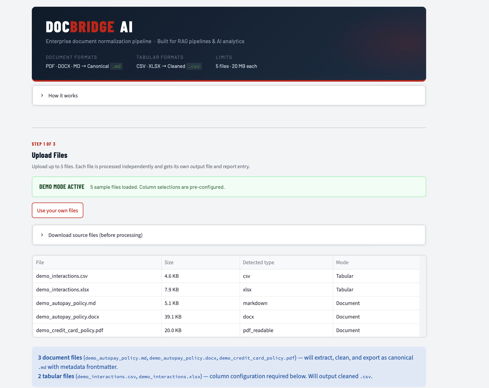
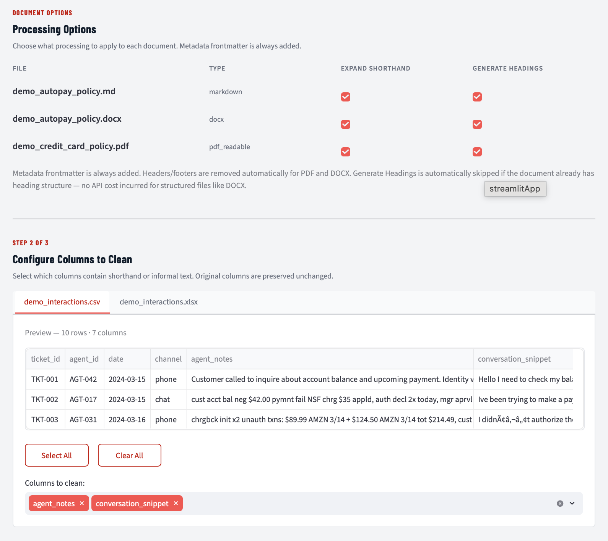
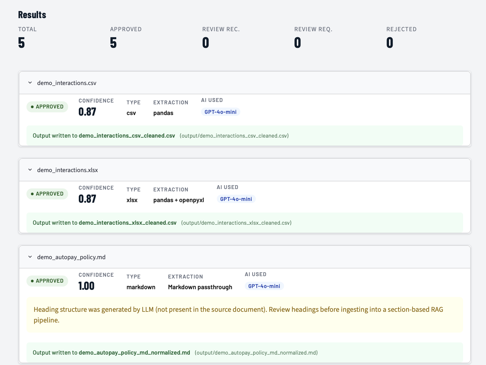
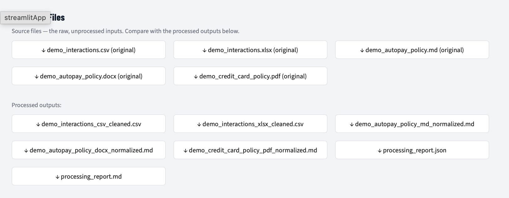

# DocBridgeAI

A document normalization pipeline. Takes PDFs, scanned docs, Word files, Markdown, and spreadsheets and converts them to clean, structured output that RAG pipelines and analytics systems can ingest without manual cleanup.

---

## Why This Exists

Most RAG tutorials, demos, and course projects start with clean, pre-formatted markdown. Real enterprise knowledge does not look like that. It lives in:

- Policy PDFs from 2018 with broken headers and footers
- Scanned compliance notices that need OCR
- Word documents with tracked changes and formatting artifacts
- Agent notes written in shorthand (`cust acct bal avail 0, auth decl, chrgbck pndng`)
- Excel sheets with customer interaction logs across hundreds of columns

Feeding any of these directly into an embedding pipeline degrades retrieval, breaks citations, and produces outputs that drift from the source. This pipeline handles the cleanup step before anything reaches the vector database.

---

## Demo






Load the 5 pre-built sample files (CSV, XLSX, Markdown, Word, PDF), configure processing options, and see per-file results with confidence scoring, extraction method, AI expansion badge, and quality warnings. Download original source files alongside processed outputs to compare before and after.

---

## How It Works

```
Raw Files (up to 5)
       ↓
  File Type Detection
       ↓
  Content Extraction
  (PyMuPDF / OCR / python-docx / pandas)
       ↓
  Text Cleaning + Shorthand Expansion
  (Domain glossary → LLM normalization)
       ↓
  Quality Validation + Confidence Scoring
       ↓
  ┌─────────────────────────────┐
  │  Approved  │  Flagged  │  Rejected  │
  └─────────────────────────────┘
       ↓
  Clean Output + Processing Report
```

Every run produces a processing report showing what was processed, how it was extracted, the confidence score, any issues flagged, and the routing decision.

---

## Two Processing Modes

### Document Mode

Converts unstructured documents into canonical markdown files with YAML frontmatter. Designed to feed RAG knowledge bases.

**Supported formats:** `.pdf` (readable), `.pdf` (scanned), `.docx`, `.md`

**Output:** One `.md` file per input, with metadata including doc ID, title, doc type, extraction method, confidence score, and processing status.

```yaml
---
doc_id: PL-AUTOPAY-POLICY
title: Autopay Policy
doc_type: policy
source_format: pdf
extraction_method: pymupdf
extraction_confidence: 0.94
processing_status: approved
processed_date: 2026-06-02
---

# Autopay Policy

## Overview
Autopay helps customers make recurring monthly loan payments automatically...
```

### Tabular Mode

Cleans structured data files where content is informal, abbreviated, or written in domain shorthand. Designed to normalize customer interaction logs, agent notes, and support records.

**Supported formats:** `.csv`, `.xlsx`

**Output:** A new `.csv` with original columns preserved, plus `[col]_cleaned`, `flags`, and `confidence_score` columns.

| original_notes | original_notes_cleaned | flags | confidence_score |
|---|---|---|---|
| cust acct bal avail 0 auth decl | Customer account balance available is 0, authorization declined | | 0.91 |
| chrgbck pndng - escl to sup | Chargeback pending - escalated to supervisor | shorthand_density_high | 0.78 |

---

## Quality Validation

Each file is scored on extraction quality and routed to one of four statuses:

| Confidence | Status | Action |
|---|---|---|
| ≥ 0.85 | Approved | Output written, ready to ingest |
| 0.60 – 0.84 | Review Recommended | Output written, flagged for human check |
| < 0.60 | Review Required | Output written, strongly flagged |
| Extraction failed | Rejected | No output, reason in report |

Silently ingesting low-confidence OCR output or garbled shorthand is how RAG systems start hallucinating. The pipeline flags the problem before it gets buried downstream.

---

## Shorthand Expansion

Text normalization uses a two-layer approach:

**Layer 1 — Domain glossary:** A curated dictionary of banking and fintech abbreviations is applied first. Fast, deterministic, auditable. Covers common terms like `acct → account`, `cust → customer`, `txn → transaction`, `chrgbck → chargeback`, and dozens more.

**Layer 2 — LLM normalization:** Any remaining informal language, context-dependent shorthand, or unclear abbreviations are passed to GPT-4o-mini with a strict prompt: expand and normalize, do not paraphrase, do not change meaning, preserve all facts.

The processing report logs which terms were handled by glossary vs. LLM.

---

## Integration with Other Projects

Built as a shared preprocessing layer for two other projects in this portfolio:

**[NextGenCapitalRAG](../NextGenCapitalRAG)** — A banking assistant RAG system. DocBridgeAI normalizes policy documents and compliance files into the markdown format the RAG ingestion pipeline expects.

**[AIServicingIntelligence](../AIServicingIntelligence)** — A customer servicing AI system. DocBridgeAI cleans agent interaction logs from Excel/CSV exports into structured data the analytics layer can use.

Both projects have different input types and output requirements, which is why this ended up as a standalone repo rather than a module inside either one.

---

## Getting Started

### Prerequisites

- Python 3.11+
- [uv](https://docs.astral.sh/uv/) (recommended) or pip
- Tesseract OCR (required for scanned PDF support)
  - macOS: `brew install tesseract`
  - Ubuntu: `sudo apt install tesseract-ocr`

### Installation

```bash
git clone https://github.com/your-username/DocBridgeAI.git
cd DocBridgeAI
cp .env.example .env
# Add your OpenAI API key to .env
uv sync
```

### Run the app

```bash
uv run streamlit run app.py
```

Upload up to 5 files, select processing options, and download your cleaned output.

### Run the pipeline via CLI (coming in v1.1)

```bash
python -m docbridgeai.pipeline --input raw_sources/ --output knowledge-base/
```

---

## Limitations and Scope

v1 is scoped for demo use:

- Maximum 5 files per session, 20 MB each
- No audio support (MP3, WAV)
- No cloud storage connectors (SharePoint, Google Drive, Confluence)
- No human review workflow

The architecture is stateless per document, so the 5-file cap is a UI decision. See the scalability section for what would change at volume.

### Known Extraction Limitations

**Images, charts, and graphs in PDFs**
DocBridgeAI extracts text only. Images, charts, diagrams, and graphs embedded in PDF files are **not extracted** — only the surrounding text is processed. A policy document with a flowchart or a report with revenue graphs will produce clean prose output but the visual content will be absent. This is reflected in the confidence score (low text-to-page ratio triggers a lower extraction confidence hint). At scale, replace Tesseract with AWS Textract or Google Document AI, which can describe image regions and extract structured table data.

**Table structure in PDFs**
PyMuPDF's `find_tables()` API detects and renders explicitly bordered tables as markdown. However, many PDF tables use whitespace and column alignment rather than visible borders — these are extracted as flat sequential text (column-row relationship is lost). For PDFs where table content is critical (e.g., fee schedules from a PDF generator without explicit borders), output should be reviewed before RAG ingestion. For reliable PDF table extraction at scale, swap PyMuPDF for a cloud OCR service such as AWS Textract or Google Document AI.

**DOCX tables**
Word document tables are extracted and rendered as GitHub-flavored markdown pipe tables in their correct document position. A quality warning is added to the processing report if tables are detected in the source but absent from the output.

**Heading structure and RAG chunking**
PDFs do not embed semantic heading markup — heading text looks the same as body text to the extractor. This means PDF output is often flat markdown with no `#` headings. The validator detects this and flags it with a `heading_structure: none` in the frontmatter and a warning in the processing report. **Impact on RAG:** Section-based chunking (split by `##` heading) will not work on flat documents — use sentence-level or semantic chunking instead. The **Generate Headings** feature (requires API key) uses GPT-4o-mini to add heading structure where none exists; generated headings are flagged as `llm_generated_structure: true` so they can be reviewed before ingestion.

**OCR confidence on scanned PDFs**
Tesseract OCR accuracy degrades with poor scan quality, handwriting, rotated pages, or unusual fonts. The validator scores OCR confidence using Tesseract's per-word confidence values and flags output below 0.60 as `review_required`. For production-grade OCR, swap Tesseract for a cloud OCR service — the `ScannedPDFExtractor` class is the only component that changes.

**Frontmatter metadata depth**
DocBridgeAI infers extraction metadata: `doc_id`, `title`, `doc_type`, `source_format`, `extraction_method`, `extraction_confidence`, `heading_structure`. It does **not** infer business-layer fields like `product`, `audience`, `compliance_critical`, `related_docs`, or `effective_date` — these require knowledge of your organization's document taxonomy and cannot be determined from content alone. Downstream knowledge base management (e.g., NextGenCapitalRAG's document catalog) is the appropriate place to enrich these fields after DocBridgeAI produces clean output.

**XLSX: first sheet only**
Excel files with multiple sheets are processed on the first sheet only. Move the data you want to clean to the first sheet before uploading. A note is shown in the UI when an XLSX file is detected.

---

## Scalability Path

DocBridgeAI v1 is a single-process pipeline with a 5-file cap. The architecture was designed so that none of the core pipeline contracts need to change to scale to enterprise volume.

**From 5 files to 50,000:**
- Replace single-process execution with a task queue (Celery + Redis or AWS SQS)
- Replace local output folder with cloud object storage (S3, GCS, Azure Blob)
- Run extraction workers in parallel — each document is stateless

**From local uploads to enterprise sources:**
- Add connector adapters for SharePoint, Google Drive, Confluence, Notion
- The pipeline receives an `ExtractedContent` object regardless of source — connectors are upstream of the pipeline

**From Tesseract to production OCR:**
- Swap Tesseract for AWS Textract, Google Document AI, or Azure Form Recognizer
- The `ScannedPDFExtractor` class is the only file that changes

**From pandas to big data tabular processing:**
- Swap pandas for Polars, DuckDB, or Spark for billion-row interaction logs
- The `TabularExtractor` interface stays the same

**Human review queue:**
- Add a database-backed review table for flagged documents
- Build a simple review UI on top of it
- Connect reviewer approval to re-trigger the export step

---

## Tech Stack

| Component | Tool |
|---|---|
| UI | Streamlit |
| PDF extraction | PyMuPDF |
| OCR | pytesseract + Tesseract |
| Word documents | python-docx |
| Tabular data | pandas + openpyxl |
| LLM expansion | OpenAI GPT-4o-mini |
| Text validation | langdetect, custom scoring |
| Package management | uv |

---

## Project Structure

```
DocBridgeAI/
  src/
    pipeline/
      models.py       — data objects (SourceFile, ProcessedDocument, ProcessingIssue)
      detector.py     — file type detection and mode routing
      extractors.py   — per-format extraction classes
      cleaner.py      — text cleaning and shorthand expansion
      validator.py    — confidence scoring and quality routing
      exporter.py     — output file writing
      report.py       — processing report generation
      pipeline.py     — full pipeline orchestration
    glossary/
      financial.json  — banking shorthand dictionary
  app.py              — Streamlit UI
  output/             — processed files (gitignored)
  private/            — project docs, PRD, TDD, design notes
  .env.example        — environment variable template
  pyproject.toml
```

---

## License

MIT
